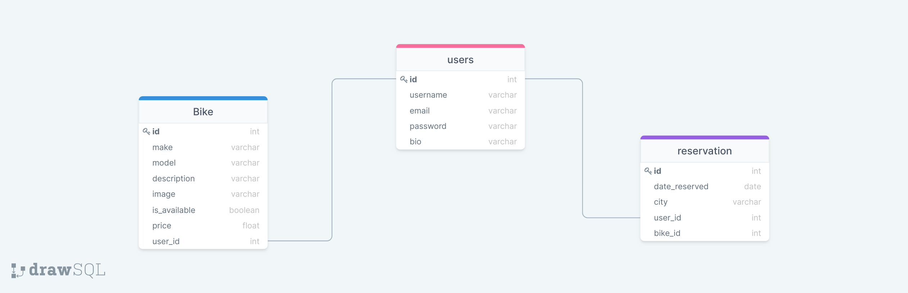
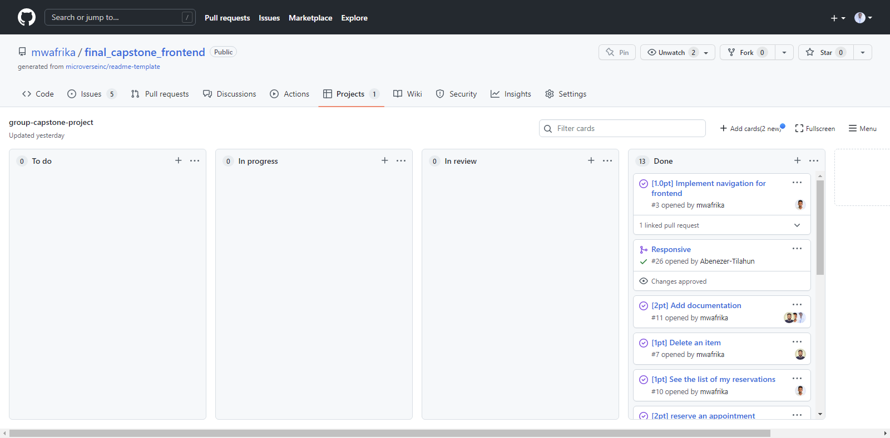

<div id="top" align="center">
  <a href="https://www.microverse.org/">
    
  </a>
  
  <a href="https://github.com/mwafrika/final_capstone_backend">
    
  </a>
  <a href="https://github.com/mwafrika/final_capstone_backend">
    
  </a>
  <a href="https://github.com/mwafrika">
    
  </a>
</div>

<br />

<div id="header" align="center">
  <a href="#">
    
  </a>
  <p align="center">
    <br />
    <a href="https://yamaha-motor.herokuapp.com/api-docs/index.html"><strong>Explore the API docs »</strong></a>
    <br />
    <br />
    <a href="https://github.com/mwafrika/final_capstone_backend">View Demo</a>
    ·
    <a href="https://github.com/mwafrika/final_capstone_backend/issues">Report Bug</a>
    ·
    <a href="https://github.com/mwafrika/final_capstone_backend">Request Feature</a>
  </p>
</div>

<!-- TABLE OF CONTENTS -->
<details>
  <summary>TABLE OF CONTENTS</summary>
  <ol>
    <li>
      <a href="#about-the-project">About The Project</a>
      <ul>
        <li><a href="#erd-diagram">ERD diagram</a></li>
        <li><a href="#built-with">Built With</a></li>
      </ul>
    </li>
    <li>
      <a href="#getting-started">Getting Started</a>
      <ul>
        <li><a href="#prerequisites">Prerequisites</a></li>
        <li><a href="#installation">Installation</a></li>
      </ul>
    </li>
    <li><a href="#usage">Usage</a></li>
    <li><a href="#kanban-board">Kanban board</a></li>
    <li><a href="#contributing">Contributing</a></li>
    <li><a href="#authors">Authors</a></li>
    <li><a href="#acknowledgments">Acknowledgments</a></li>
    <li><a href="#license">License</a></li>
  </ol>
</details>

<br />

## About The Project

> **Yamaha Motor App** is a motorcycle reservation platform that allows customers to book their motorcycle remotely within a defined time frame.

### ERD diagram



### Built With

<ul style="display: flex; gap: 6px; justify-content: center">


<br></br>
</ul>

## Getting Started

To get a local copy up and running follow these simple example steps.

### Prerequisites

- POSTGRESQL _~> 14.x_
- Ruby _~> 3.1.x_

### Installation

1. Clone the repo:
   ```sh
   git clone git@github.com:mwafrika/final_capstone_backend.git
   ```
2. go to the project folder:
   ```sh
   cd final_capstone_backend
   ```
3. Install the dependencies:
   ```sh
   bundle install
   ```
4. Set the following the environment variables for database:
   ```
   DATABASE_NAME
   USER_PASSWORD
   USER_NAME
   ```
5. Create database:
   ```sh
   rails db:create
   ```
6. Run the migrations:
   ```sh
   rails db:migrate
   ```
7. Seed the database:

   ```sh
   rails db:seed
   ```

8. Generate a secret key:
   ```sh
    rails secret
   ```
9. Edit your credentials.yml.enc file:

```sh
$env:EDITOR="notepad"

rails credentials:edit
```

11. Set the credentials to decode the JWT

```sh
secret_key_base: <your secret key>
```

12. Launch the server:

```sh
rails s -p 8000
```

<p align="right"><a href="#top">⬆️</a></p>

## Usage

_For more Info on how to use the API, please refer to the [Yamaha motor API Documentation](https://yamaha-motor.herokuapp.com/api-docs/index.html)_

## Kanban board

👉 [Kanban board link](https://github.com/mwafrika/final_capstone_frontend/projects/1)



👉 This project was authored by <a href="#authors">Four contributors</a> as described in the the Authors section bellow.

👉 Please use this [link](https://github.com/mwafrika/final_capstone_frontend) to go to the front-end part of this project.

<p align="right"><a href="#top">⬆️</a></p>

## Contributing

Contributions are what make the open source community such an amazing place to learn, inspire, and create. Any contributions you make are **greatly appreciated**.

Please, take a look at [open issues](https://github.com/mwafrika/final_capstone_backend/issues) for a full list of proposed features (and known issues).

If you have a suggestion that would make this better, please fork the repo and create a pull request. You can also simply open an issue with the tag "enhancement".

Don't forget to give the project a star! Thanks again!

1. Fork the Project
2. Create your Feature Branch (`git checkout -b feature/AmazingFeature`)
3. Commit your Changes (`git commit -m 'Add some AmazingFeature'`)
4. Push to the Branch (`git push origin feature/AmazingFeature`)
5. Open a Pull Request

<p align="right"><a href="#top">⬆️</a></p>

## Authors

👤 **Mwafrika Josué**

- GitHub: [@mwafrika](https://github.com/mwafrika)
- LinkedIn: [@mwafrika-mufungizi](https://linkedin.com/in/mwafrika-mufungizi)
- Twitter: [@mwafrikamufung1](https://twitter.com/mwafrikamufung1)
- Website: [mwafrika.me](https://mwafrika-portfolio-app.herokuapp.com/)

👤 **Bushra Mostafa**

- GitHub: [@bushra](https://github.com/)
- LinkedIn: [bushra](https://www.linkedin.com/in/)
- Twitter: [@bushra](https://twitter.com/)

👤 **Abenezer Tilahun**

- GitHub: [Abenezer Tilahun](https://github.com/)
- Website: [Abenezer Tilahun](https://codingfries.com)
- LinkedIn: [Abenezer Tilahun](https://www.linkedin.com/in/)

<p align="right"><a href="#top">⬆️</a></p>

<!-- ACKNOWLEDGMENTS -->

## Acknowledgments

- Original design by [Murat Korkmaz](https://www.behance.net/muratk).
- [GitHub Emoji Cheat Sheet](https://www.webpagefx.com/tools/emoji-cheat-sheet)
- [Img Shields](https://shields.io)
- [React Icons](https://react-icons.github.io/react-icons/search)

<p align="right"><a href="#top">⬆️</a></p>

<!-- LICENSE -->

## License

Distributed under the **AGPL** License. See [`LICENSE`](./LICENSE) for more information.

<p align="right"><a href="#top">⬆️</a></p>
